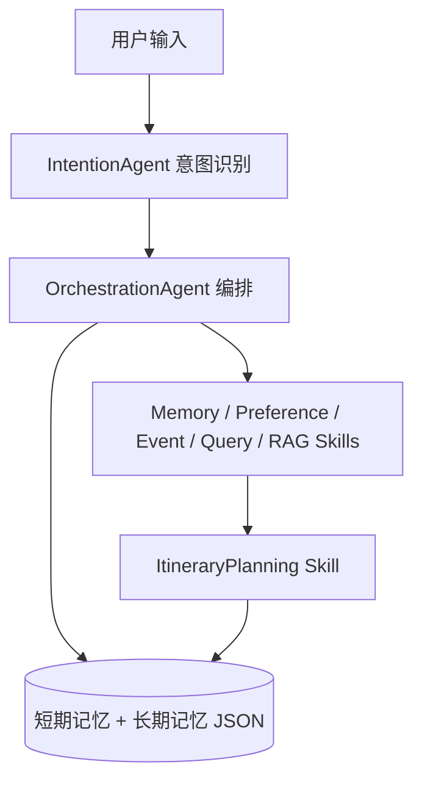

# 差旅出行助手Multi-Agent系统

基于 **大语言模型** 与 **AgentScope** 的多智能体差旅助手：用语义意图识别驱动 Plan-and-Execute 编排，集成 RAG 企业知识、联网搜索与长期/短期记忆，在终端通过 CLI 交互。

---

## 项目简介

- **目标**：理解自然语言差旅诉求，完成政策问答、行程要素收集、偏好记忆、实时信息查询与行程规划等任务。
- **特点**：
  - 多意图路由（行程规划、记忆查询、偏好、RAG 问答、联网查询、事项收集等）
  - **Skill 插件化**：子能力位于 `.claude/skills/`，由编排层按需加载
  - **RAG**：Milvus Lite + 本地中文 Embedding（`data/models/bge-small-zh-v1.5`）
  - **韧性**：LLM 调用重试、熔断与健康检查（见 `config.py` 中 `RESILIENCE_CONFIG`）

当前仓库以 **命令行（`cli.py`）** 为主入口；长期记忆默认使用 **`data/memory/{user_id}.json`** 文件存储（生产环境可替换为数据库实现）。

---

## 架构概览

核心数据流：**用户输入 → 意图识别 → 编排调度 → 多 Skill 执行 → 结果聚合与记忆更新**。



- **`agents/intention_agent.py`**：解析用户意图并生成调度计划（JSON）。
- **`agents/orchestration_agent.py`**：按优先级调度子智能体；同优先级可并行（`asyncio.gather`）。
- **`agents/lazy_agent_registry.py`**：Skill 发现与懒加载。
- **`context/memory_manager.py`**：短期上下文与长期偏好、行程等持久化接口。

更细的模块说明与扩展路线可参考仓库内 `README原版.md`。

---

## 环境要求

- Python 3.10+（建议与本地已验证版本一致）
- 可访问的大模型 HTTP API（在 `config.py` 的 `LLM_CONFIG` 中配置）
- 首次使用 RAG 前需初始化向量库（见下文）

依赖安装：

```bash
pip install -r requirements.txt
```

---

## 配置

编辑项目根目录 **`config.py`**：

| 配置块 | 说明 |
|--------|------|
| `LLM_CONFIG` | `api_key`、`model_name`、`base_url`、`temperature`、`max_tokens` |
| `SYSTEM_CONFIG` | 超时、日志级别等 |
| `RAG_CONFIG` | 本地 Embedding 模型路径（默认 `data/models/bge-small-zh-v1.5`） |
| `RESILIENCE_CONFIG` | 重试、熔断阈值、健康检查超时 |

请勿将真实密钥提交到公开仓库；可使用环境变量或本地未跟踪配置文件（按团队规范自行封装）。

---

## 启动方式

### 1. 初始化 RAG 知识库（首次必做）

```bash
python .claude/skills/ask-question/script/init_knowledge_base.py
```

生成数据默认位于 `.claude/skills/ask-question/data/`（含 Milvus Lite 库文件）。

### 2. 启动交互式 CLI

```bash
python cli.py
```

启动后按提示输入 **用户 ID**（默认 `default_user`），随后可直接用自然语言对话。

### 3. 内置命令（CLI）

| 命令 | 说明 |
|------|------|
| `help` | 帮助 |
| `status` | 当前状态与记忆摘要 |
| `health` | LLM 可达性与熔断状态 |
| `clear` | 清空当前任务上下文（保留长期记忆） |
| `history` / `preferences` | 查看行程历史 / 偏好 |
| `exit` | 退出 |

**仅健康检查（非交互，适合脚本/监控）**：

```bash
python cli.py health
```

成功时退出码为 `0`，失败为 `1`。

---

## API 示例

本仓库**未提供 HTTP REST 服务**；对外“接口”形态为 **CLI 自然语言** 与 **Python 异步调用链**。

### 1. CLI 侧（自然语言）

在 `python cli.py` 交互中直接输入，例如：

- RAG：`出差住宿标准是多少？`
- 规划：`我下周从北京去杭州出差三天，帮我安排行程。`
- 偏好：`我喜欢住华住会旗下酒店，常坐国航，请记住。`
- 联网：`杭州明天天气怎么样？`
- 记忆：`我之前说过哪些出行偏好？`

### 2. 编程调用（与测试脚本一致）

编排主干与集成测试 `tests/test_cli_qa.py` 相同：**意图 → 编排**，返回的 `orchestration_result.content` 为 **JSON 字符串**，可再解析或交给 CLI 的展示逻辑。

```python
import asyncio
import json
from agentscope.message import Msg
from agentscope.model import OpenAIChatModel
from config import LLM_CONFIG
from config_agentscope import init_agentscope
from context.memory_manager import MemoryManager
from agents.intention_agent import IntentionAgent
from agents.orchestration_agent import OrchestrationAgent
from agents.lazy_agent_registry import LazyAgentRegistry


async def run_once(user_text: str) -> dict:
    init_agentscope()
    model = OpenAIChatModel(
        model_name=LLM_CONFIG["model_name"],
        api_key=LLM_CONFIG["api_key"],
        client_kwargs={"base_url": LLM_CONFIG["base_url"]},
        temperature=LLM_CONFIG.get("temperature", 0.7),
        max_tokens=LLM_CONFIG.get("max_tokens", 2000),
    )
    memory_manager = MemoryManager(
        user_id="api_demo_user",
        session_id="session_1",
        llm_model=model,
    )
    intention_agent = IntentionAgent(name="IntentionAgent", model=model)
    registry = LazyAgentRegistry(model, {}, memory_manager)
    orchestrator = OrchestrationAgent(
        name="OrchestrationAgent",
        agent_registry=registry,
        memory_manager=memory_manager,
    )

    ctx = [Msg(name="user", content=user_text, role="user")]
    intention_msg = await intention_agent.reply(ctx)
    out_msg = await orchestrator.reply(intention_msg)
    return json.loads(out_msg.content)


if __name__ == "__main__":
    result = asyncio.run(run_once("从北京到上海出差两天，列出大致行程要点"))
    print(json.dumps(result, ensure_ascii=False, indent=2))
```

若在自有应用中嵌入 CLI 已有会话与熔断逻辑，可使用 **`AligoCLI`** 的 **`initialize_system()`** 与 **`process_query(user_input)`**（见 `cli.py`），行为与终端一致。

---

## 评测方式

### 端到端集成评测（推荐）

覆盖多条预设问题并生成 Markdown 报告（含耗时与成功率）：

```bash
python tests/test_cli_qa.py
```

报告输出目录：`tests/results/`，文件名形如 `qa_test_YYYYMMDD_HHMMSS.md`。

### 模块与单元测试

按需单独运行：

```bash
python tests/test_memory_system.py
python tests/test_intention_agent.py
python tests/test_orchestration.py
python tests/test_rag_agent.py
python tests/test_event_collection_agent.py
python tests/test_information_query_agent.py
```

**说明**：意图识别、规划与 RAG 等测试依赖 **真实 LLM 与网络（如联网搜索）**，结果可能随模型与外部环境波动；评测时宜固定模型版本并记录时间戳。

---

## 项目结构

### 智能体分层说明

| 层级 | 组件 | 职责 |
|------|------|------|
| 编排入口 | `IntentionAgent` | 解析用户意图，产出调度计划（JSON） |
| 编排入口 | `OrchestrationAgent` | 按优先级调用子 Agent，聚合结果 |
| 插件注册 | `LazyAgentRegistry` | 扫描 `.claude/skills/*/script/agent.py` 并懒加载实例 |

子智能体均以 **Skill 插件** 形式实现；意图侧常用 **`agents/lazy_agent_registry.py` 中的遗留别名** 指向对应目录（如下表）。

| 调度名（意图/编排使用） | Skill 目录 | Agent 类 | 说明 |
|-------------------------|------------|----------|------|
| `rag_knowledge` | `ask-question/` | `RAGKnowledgeAgent` | 企业差旅知识库 RAG |
| `memory_query` | `memory-query/` | `MemoryQueryAgent` | 历史行程、偏好、对话记忆 |
| `preference` | `preference/` | `PreferenceAgent` | 偏好抽取与持久化 |
| `information_query` | `query-info/` | `InformationQueryAgent` | 联网搜索（DDGS）+ 摘要 |
| `event_collection` | `event-collection/` | `EventCollectionAgent` | 出差要素收集 |
| `itinerary_planning` | `plan-trip/` | `ItineraryPlanningAgent` | 行程规划（含 `plan_trip_execution.py` 执行脚本） |

### 目录树（含 Agent 与关键文件）

```
.
├── agents/                                 # 编排层（非 Skill）
│   ├── intention_agent.py                  # IntentionAgent：意图识别
│   ├── orchestration_agent.py              # OrchestrationAgent：多 Agent 调度
│   ├── lazy_agent_registry.py              # LazyAgentRegistry：Skill 发现与懒加载
│   └── __init__.py
│
├── .claude/skills/                         # Skill 插件根目录（每个子目录一个子 Agent）
│   ├── ask-question/                       # → RAGKnowledgeAgent（调度名 rag_knowledge）
│   │   ├── SKILL.md
│   │   ├── script/
│   │   │   ├── agent.py                    # RAGKnowledgeAgent 实现
│   │   │   └── init_knowledge_base.py      # 向量库初始化
│   │   └── data/                           # 文档 + Milvus Lite 数据文件
│   ├── memory-query/                       # → MemoryQueryAgent
│   │   ├── SKILL.md
│   │   └── script/agent.py
│   ├── preference/                         # → PreferenceAgent
│   │   ├── SKILL.md
│   │   └── script/agent.py
│   ├── query-info/                         # → InformationQueryAgent
│   │   ├── SKILL.md
│   │   └── script/agent.py
│   ├── event-collection/                   # → EventCollectionAgent
│   │   ├── SKILL.md
│   │   └── script/agent.py
│   ├── plan-trip/                          # → ItineraryPlanningAgent
│   │   ├── SKILL.md
│   │   └── script/
│   │       ├── agent.py
│   │       └── plan_trip_execution.py      # 规划流程执行辅助
│   └── README.md
│
├── context/                                # 记忆子系统
│   ├── memory_manager.py                   # MemoryManager：统一短/长期记忆入口
│   ├── short_term_memory.py                # 会话级短期上下文
│   ├── long_term_memory.py                 # 持久化长期记忆（默认 JSON 后端）
│   └── __init__.py
│
├── utils/
│   ├── skill_loader.py                     # Skill 元数据与加载辅助
│   ├── json_parser.py                      # JSON 解析工具
│   ├── circuit_breaker.py                  # 熔断器
│   └── llm_resilience.py                   # 重试、健康检查
│
├── data/
│   ├── memory/                             # 长期记忆：{user_id}.json
│   └── models/
│       └── bge-small-zh-v1.5/              # 本地 Embedding（RAG）
│
├── tests/                                  # 单测与集成；results/ 下为 QA 报告
│   ├── test_cli_qa.py
│   ├── test_intention_agent.py
│   ├── test_orchestration.py
│   ├── test_memory_system.py
│   ├── test_rag_agent.py
│   ├── test_event_collection_agent.py
│   └── test_information_query_agent.py
│
├── cli.py                                  # CLI：AligoCLI，交互入口
├── config.py                               # LLM / RAG / 韧性配置
├── config_agentscope.py                    # AgentScope 初始化
└── requirements.txt
```

---

## 许可证

如无另行声明，以仓库根目录许可证文件为准；历史文档中曾标注 MIT，添加 `LICENSE` 文件后即可与之对齐。
